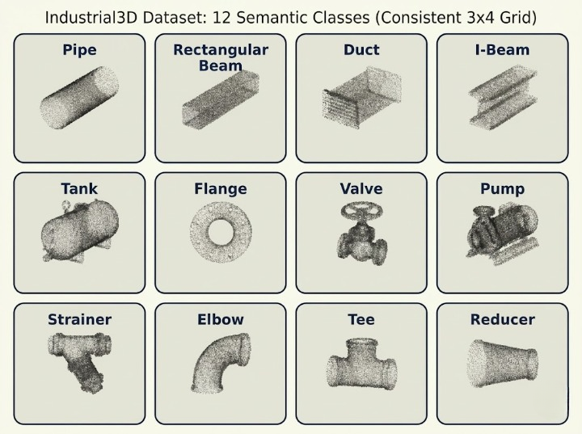
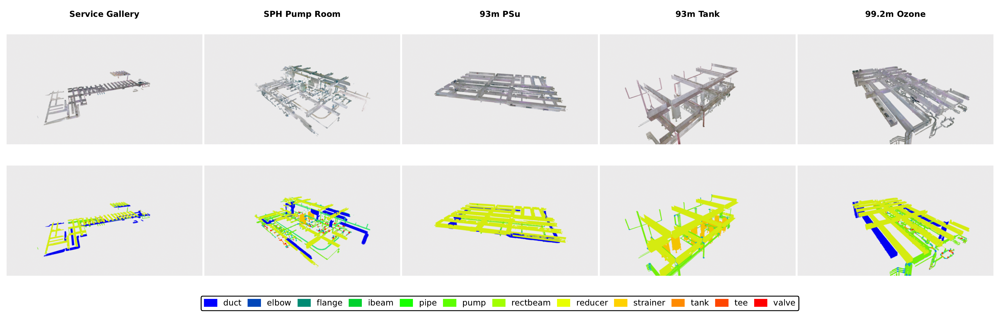
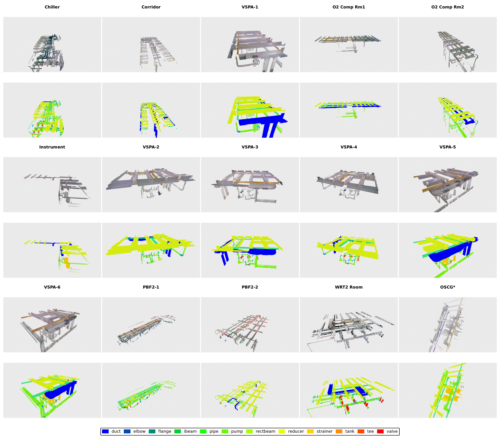
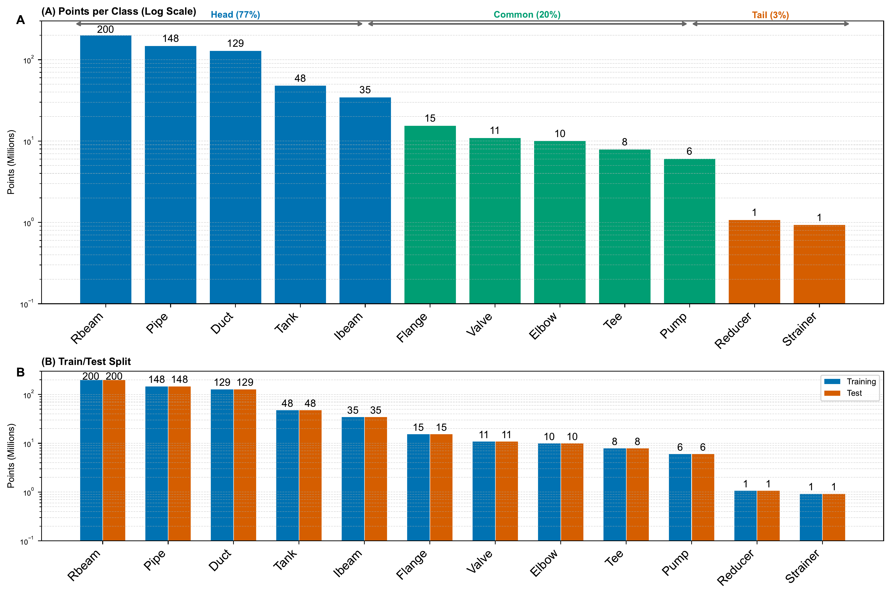

# Industrial3D

**📄 Paper:** [Industrial3D: A Terrestrial LiDAR Point Cloud Dataset and Cross-Paradigm Benchmark for Industrial Infrastructure](https://arxiv.org/abs/2603.28660) (**Under Review**)

**⚠️ Under active development.** Dataset and code will be released upon paper acceptance.

## Overview

Industrial3D is a large-scale, high-resolution point cloud dataset for industrial Mechanical, Electrical, and Plumbing (MEP) scene understanding. Furthermore, we benchmark 9 representative methods on the Industrial3D across 4 DL paradigms (fully supervised, weakly supervised, unsupervised, and foundation model). 

- **Scale:** 612.7 million labeled points from 7 water treatment facilities
- **Resolution:** 6mm terrestrial laser scanning (TLS)
- **Diversity:** 12 semantic classes (MEP + structural elements)
- **Authenticity:** Real industrial environments with realistic occlusion, noise, and complexity

## Figures


*Figure: Industrial3D graphical abstract showing dataset overview and benchmark framework.*


*Figure: Industrial water treatment facility with UAV photography and annotated point cloud examples.*



*Figure: All 12 semantic classes (Synthetic point clouds) in Industrial3D: Pipe, Cable Tray, Duct, Valve, Instrument, Support, Equipment, Handrail/Grating, Beam, Column, Wall, Floor.*



*Figure: Scene gallery of 4 representative scenes in Industrial3D.*



*Figure: Additional scenes in Industrial3D.*



*Figure: Statistical distribution of 612.7M labeled points across 3 tiers. Industrial3D has a **215:1 class imbalance** (head:tail), 3.5× more severe than S3DIS.*


## Scene Videos

**20 unique rooms** across 13 areas. 4 representative scenes:

| # | Area     | Room            | Split | Video          |
|---|----------|-----------------|-------|----------------|
| 1 | Area 2   | Service Gallery | Train | [Watch ▶](videos/Area_2_service_gallery_gt.mp4) |
| 2 | Area 12  | SPH Pump Room   | Test  | [Watch ▶](videos/Area_12_SPHRoom_1_gt.mp4) |
| 3 | Area 6-1 | 93m Psu         | Test  | [Watch ▶](videos/Area_6_OGB_93m_PSu_Rm_Rella_Choy_gt.mp4) |
| 4 | Area 3   | 93m Tank        | Train | [Watch ▶](videos/Area_3_OGB_93m_Tank_Area_no.1_Lowie_Man_gt.mp4) |

### Scene Previews


*Area 2: Service Gallery (Train) - Largest at 79.6M points with highest MEP density*


*Area 12: SPH Pump Room (Test) - Test set representative with compact equipment*


*Area 6-1: 93m Psu (Test) - Test set with moderate complexity*


*Area 3: 93m Tank (Train) - Large tank structure showing geometric diversity*

**Why these 4:**

- Service Gallery: Largest at 79.6M points with highest MEP density
- SPH Pump Room: Test set representative with compact equipment
- 93m Psu: Test set with moderate complexity
- 93m Tank: Large tank structure showing geometric diversity

**📁 Full dataset coming soon!** All 20 rooms (RGB + ground truth videos and renders) will be uploaded to [Google Drive](https://drive.google.com/drive/folders/1T6viLM-SKrDZBCaoKghgld2pIyRq6XLZ?usp=sharing). **Stay tuned for the complete collection!**

## Dataset Statistics

| Metric              | Value                      |
|---------------------|----------------------------|
| Total Scanned Area  | 20,000+ m² (estimated)                 |
| Labeled Points      | 612.7 million              |
| Raw Scan Data       | 2.3+ billion points        |
| Point Density       | 6mm TLS resolution         |
| Annotation Effort   | 754 person-hours           |
| Facilities          | 13 type of water treatment facilities   |
| Areas               | 13 areas                   |
| Rooms               | 20 unique rooms/scenes     |

## Benchmark

### Methods Evaluated

**Fully-Supervised:**
- ResPointNet++
- KPConv
- PosPool
- ResPointNet++ with Class-Balanced (CB) loss

**Weakly-Supervised:**
- SQN (0.1% labels)

**Self-Supervised:**
- GrowSP (3-stage pipeline: Superpoints, Primitives, Merged Primitives)

**Foundation Models:**
- Point-SAM (zero-shot)

### Key Results

| Paradigm          | Method                     | mIoU   |
|-------------------|----------------------------|--------|
| Fully-Supervised  | ResPointNet++ w. CB        | 54.05% |
| Fully-Supervised  | KPConv                     | 53.65% |
| Weakly-Supervised | SQN (0.1% labels)          | 44.29% |
| Self-Supervised   | GrowSP                     | 11.73% |
| Foundation Model  | Point-SAM (zero-shot)      | 35.2%  |
| Foundation Model  | Point-SAM (10% few-shot)   | 74.5%  |

## 📚 Citation

```bibtex
@article{yin2026industrial3d,
  title={Industrial3D: A Terrestrial LiDAR Point Cloud Dataset and Cross-Paradigm Benchmark for Industrial Infrastructure},
  author={Yin, Chao and Yue, Hongzhe and Han, Qing and Hu, Difeng and Liang, Zhenyu and Lin, Fangzhou and Sun, Bing and Wang, Boyu and Li, Mingkai and Yao, Wei and Cheng, Jack C.P.},
  journal={arXiv preprint arXiv:2603.28660},
  year={2026}
}
```